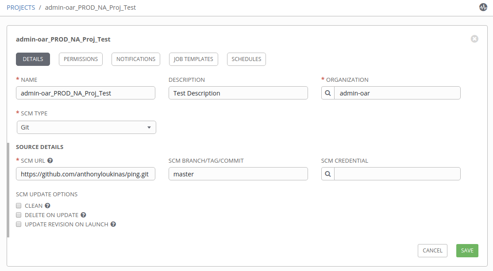
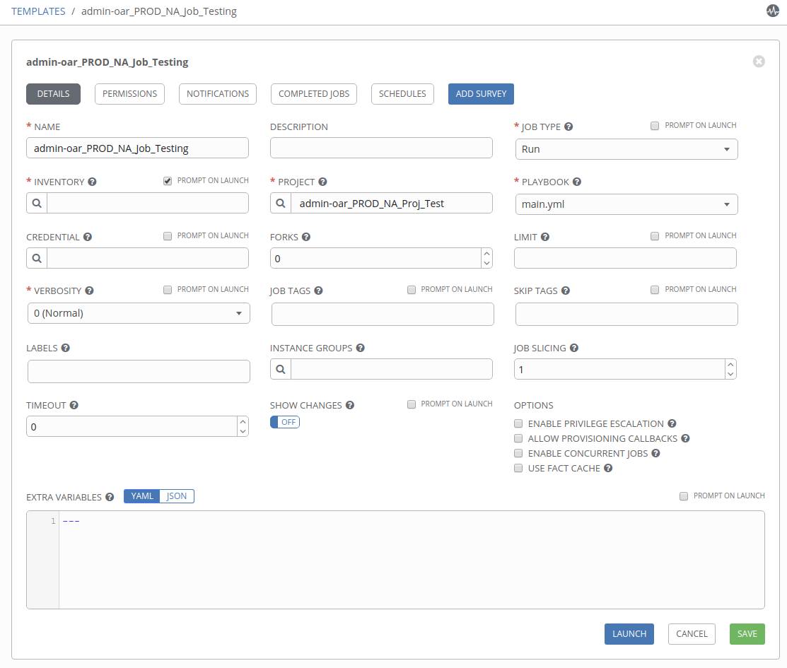

# AWX Promotion Pipeline

Ansible AWX code promotion solution using Ansible playbooks and the tower modules. This can be consumed via Jenkins, GitHub Actions, GitLab and others for full code promotion and rigid tower resource definitions. This solution also allows you to audit your code promotion using native Git tools.

## Table of Contents

- [AWX Promotion Pipeline](#awx-promotion-pipeline)
  - [Table of Contents](#table-of-contents)
  - [Requirements](#requirements)
  - [Getting Started](#getting-started)
    - [Generate Base .awx-pipeline.yml](#generate-base-awx-pipelineyml)
    - [Importing Content](#importing-content)
  - [Supported Options](#supported-options)
    - [Project](#project)
    - [Job Template](#job-template)
  - [Authors](#authors)

## Requirements

## Getting Started

In order to use this pipeline we need to define a base set of variables in the `vars/` sub-directory.

We've provided a base example called `vars/NA_development.yml`.

### Generate Base .awx-pipeline.yml

If you want to generate the absolute minimum working project/job_template definitions in an .awx-pipeline.yml, use the `generate-pipeline.yml` provided playbook.

```bash
ansible-playbook generate-pipeline.yml
```

```bash
Project Name: Test
Project Description: Test Description
Project Organization Name [default]: admin-oar
Project SCM URL: https://github.com/anthonyloukinas/ping.git
Job Template Name: Testing
Job Template Playbook YML: main.yml
```

That will output the following to your directory: `awx-pipeline-Test.yml`

```yaml
---

job_templates:
  Testing:
    name: Testing
    project: Test
    playbook: main.yml
    job_type: run
    ask_inventory: yes # Set to no, if inventory: "" var set

project:
  name: Test
  description: Test Description
  organization: admin-oar
  # scm_credential: ""
  scm_url: https://github.com/anthonyloukinas/ping.git
```

You can add additional configuration to this file, and then place it in your code repository base, named `.awx-pipeline.yml`.

### Importing Content

You will need to provide the following variables to the pipeline

- `git_scm_url` - Git repository where Ansible code + .awx-pipeline.yml file exists.

These variables are covered in the lane/region specific var files in `vars/`

- `tower_lane` - Dev, UAT, Prod, etc.
- `tower_region` - NA, EU, ASIA, SA, etc.
- `tower_host_api` - Base url (localhost)
- `tower_username_api` - Tower username
- `tower_password_api` - Tower password
- `tower_proto_api` - Http or https

```bash
ansible-playbook run-pipeline.yml \ 
  -e @vars/NA_production.yml \
  -e git_scm_url=https://github.com/anthonyloukinas/ping.git
```

Project



Job Template



## Supported Options

### Project

| Parameter | Choices/Defaults | Comments |
| --- | --- | --- |
| description | Default: None | Description to use for the project. |
| name | Default: None | Name to use for the project. |
| organization | Default: None | Primary key of organization for project. |
| scm_branch | Default: master | The branch to use for the scm resource. |
| scm_clean | Default: no | Remove local modifications before updating. |
| scm_credential | Default: no | Name of the credential to use with this scm resource. |
| scm_update_on_launch | Default: no | Before an update to the local repository before launching a job with this project. |
| scm_url | Default: None | URL of scm resource. |

### Job Template

| Parameter | Choices/Defaults | Comments |
| --- | --- | --- |
| ask_credential | Default: no | Prompt user for credential on launch. |
| ask_diff_mode | Default: no | Prompt user to enable diff mode (show changes) to files when supported by modules. |
| ask_extra_vars | Default: no | Prompt user for (extra_vars) on launch. |
| ask_inventory | Default: no | Prompt user for inventory on launch. |
| ask_job_type | Default: no | Prompt user for job type on launch. |
| ask_limit | Default: no | Prompt user for a limit on launch. |
| ask_skip_tags | Default: no | Prompt user for job tags to skip on launch. |
| ask_tags | Default: no | Prompt user for job tags on launch. |
| ask_verbosity | Default: no | Prompt user to choose a verbosity level on launch. |
| become_enabled | Default: no | Activate privilege escalation. |
| concurrent_jobs_enabled | Default: no | Allow simultaneous runs of the job template. |
| credential | Default: | Name of the credential to use for the job template. |
| description | Default: | Description to use for the job template. |
| diff_mode_enabled | Default: no | Enable diff mode for the job template. |
| fact_caching_enabled | Default: no | Enable use of fact caching for the job template. |
| force_handlers_enabled | Default: no | Enable forcing playbook handlers to run even if a task fails. |
| forks | Default: | The number of parallel or simultaneous processes to use while executing the playbook. |
| inventory | Default: | Name of the inventory to use for the job template. |
| job_tags | Default: | Comma separated list of the tags to use for the job template. |
| limit | Default: | A host pattern to further constrain the list of hosts managed or affected by the playbook. |
| name | Default: | Name to use for the job template. |
| playbook | Default: | Path to the playbook to use for the job template within the project provided. |
| project | Default: | Name of the project to use for the job template. |
| skip_tags | Default: | Comma separated list of the tags to skip for the job template. |
| start_at_task | Default: | Start the playbook at the task matching this name. |
| survey_enabled | Default: no | Enable a survey on the job template. |
| survey_spec | Default: | JSON/YAML dict formatted survey definition. |
| vault_credential | Default: | Name of the vault credential to use for the job template. |
| verbosity | Default: 0 | Control the output level Ansible produces as the playbook runs. 0 - Normal, 1 - Verbose, 2 - More Verbose, 3 - Debug, 4 - Connection Debug. |

## Authors

- Anthony Loukinas <<anthony.loukinas@redhat.com>>