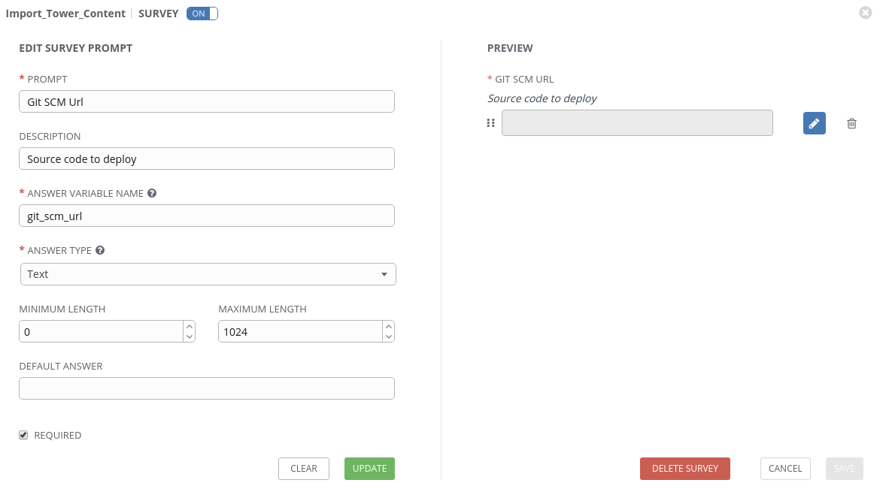
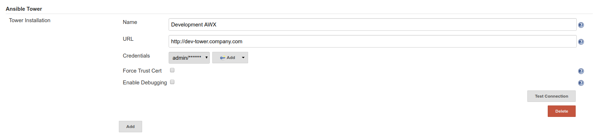

# AWX Promotion Pipeline

Ansible AWX code promotion solution using Ansible playbooks and the tower modules. This can be consumed via Jenkins, GitHub Actions, GitLab and others for full code promotion and rigid tower resource definitions. This solution also allows you to audit your code promotion using native Git tools.

## Table of Contents

- [AWX Promotion Pipeline](#awx-promotion-pipeline)
  - [Table of Contents](#table-of-contents)
  - [Requirements](#requirements)
    - [Python Packages](#python-packages)
  - [Getting Started](#getting-started)
    - [Generate Base .awx-pipeline.yml](#generate-base-awx-pipelineyml)
  - [Using the pipeline](#using-the-pipeline)
    - [Consume Pipeline using Ansible-Playbook (CLI)](#consume-pipeline-using-ansible-playbook-cli)
    - [Consume Pipeline using Ansible AWX](#consume-pipeline-using-ansible-awx)
      - [Create Ansible Tower Credential](#create-ansible-tower-credential)
      - [Create Job Template](#create-job-template)
      - [Create Survey Spec](#create-survey-spec)
      - [Launch Job Template](#launch-job-template)
    - [Consume Pipeline using Jenkins](#consume-pipeline-using-jenkins)
      - [Install Plugins](#install-plugins)
      - [Add Ansible Tower Configuration](#add-ansible-tower-configuration)
      - [Create Freestyle Build](#create-freestyle-build)
      - [Execute build](#execute-build)
    - [Results](#results)
  - [Appendix](#appendix)
    - [Removing naming schema (org, lane, region)](#removing-naming-schema-org-lane-region)
    - [Supported Parameters](#supported-parameters)
      - [Project](#project)
      - [Job Template](#job-template)
    - [Todo](#todo)
  - [Authors](#authors)

## Requirements

### Python Packages

- ansible-tower-cli

To install these python pacakges run the following command.

```bash
pip install ansible-tower-cli
```

If using Ansible AWX

```bash
/var/lib/awx/venv/awx/bin/pip install ansible-tower-cli
```

If using Jenkins/Docker Images, you will need to install these packages or bake them into your image.

## Getting Started

In order to use this pipeline we need to define a base set of variables in the `vars/` sub-directory.

We've provided a base example called `vars/NA_development.yml`.

Either modify this to your liking, or create a new one for use. All variables defined are required.

### Generate Base .awx-pipeline.yml

If you want to generate the absolute minimum working project/job_template definitions in an .awx-pipeline.yml, use the `generate-pipeline.yml` provided playbook.

```bash
ansible-playbook generate-pipeline.yml
```

```bash
Project Name: Test
Project Description: Test Description
Project Organization Name [default]: admin-oar
Project SCM URL: https://github.com/anthonyloukinas/ping.git
Job Template Name: Testing
Job Template Playbook YML: main.yml
```

That will output the following to your directory: `awx-pipeline-Test.yml`

*Note: Your file name may be different depending on what your Project was named. It's also recommended to use _'s and no spaces.*

```yaml
---

job_templates:
  Testing:
    name: Testing
    project: Test
    playbook: main.yml
    job_type: run
    ask_inventory: yes # Set to no, if inventory: "" var set

project:
  name: Test
  description: Test Description
  organization: admin-oar
  # scm_credential: ""
  scm_url: https://github.com/anthonyloukinas/ping.git
```

You can add additional configuration to this file, and then place it in your code repository base, named `.awx-pipeline.yml`. See [Supported Paramters](#supported-parameters)

## Using the pipeline

### Consume Pipeline using Ansible-Playbook (CLI)

You will need to provide the following variables

- `git_scm_url` (required) - Git repository where Ansible code + .awx-pipeline.yml file exists.
- `git_scm_version` (optional) - Branch/Tag/Commit to specifically use a version of .awx-pipeline.yml
- `project_scm_branch` (optional) - Defines which Branch/Tag/Commit to use for the imported project

These variables are covered in the lane/region specific var files in `vars/`. See: [Getting Started](#getting-started)

- `tower_lane` - Dev, UAT, Prod, etc.
- `tower_region` - NA, EU, ASIA, SA, etc.
- `tower_url` - Base url (http://localhost)
- `tower_username` - Tower username (admin)
- `tower_password` - Tower password (password)

Execute the `run-pipeline.yml` with your vars file `vars/@NA_development.yml`. (See: [Getting Started](#getting-started)), and your `git_scm_url`, which is the code you are wanting to deploy to Ansible Tower.

```bash
ansible-playbook run-pipeline.yml \ 
  -e @vars/NA_development.yml \
  -e git_scm_url=https://github.com/anthonyloukinas/ping.git
```

### Consume Pipeline using Ansible AWX

#### Create Ansible Tower Credential

Start by creating an `Ansible Tower` type credential which will contain your URL, Username, and Password to authenticate to your AWX.


#### Create Job Template

- Project: Use this repository, or your own copy.
- Inventory: Use something with localhost. (only preferred)
- Credential: Your Ansible Tower credential.
- Extra Vars: Your tower_lane and tower_region vars.


#### Create Survey Spec



#### Launch Job Template


### Consume Pipeline using Jenkins

You will need to setup a job template on your target Ansible Tower to perform the importing. See: [Consume Pipeline using Ansible AWX](#consume-pipeline-using-ansible-awx) and follow all steps.

#### Install Plugins

Home -> Manage Jenkins -> Manage Plugins -> Click "Available" tab

Now in the filter search, search for "ansible" and install both plugins

- `Ansible plugin`
- `Ansible Tower Plugin`
- `AnsiColor` - Optional, but recommended for color job outputs in Jenkins.


Optionally install the `AnsiColor` plugin for color outputs.


#### Add Ansible Tower Configuration

You need the Ansible Tower plugin installed See: [Install Ansible Plugins](#install-plugins)

Home -> Manage Jenkins -> Configure System -> Add Ansible Tower


*Note: You will need to create an Ansible Tower credential to authenticate. This user just needs execute access to the import job template*

#### Create Freestyle Build

Home -> New Item -> Freestyle Project

Under `Source Code Management`, Select Git, and fill this out with your Ansible code repository.


Optionally you can configure polling, which will check into your repo for git commit changes and kick off builds automatically. The supported timing, is cron style.

15 minute polling example:
```
H/15 * * * *
```
*Note: Use this website for creating easy to use cron timings https://crontab.guru/*


Next, add a New Build Step of type `Ansible Tower`.

Fill in your Server and Credentials details. You will also need to find the Template ID from the template you should have created in this step. See: [Consume Pipeline using Ansible AWX](#consume-pipeline-using-ansible-awx). You can get this ID, buy viewing the job template in Tower, and looking at the url.

- Extra Vars:
  - tower_region
  - tower_lane
  - git_scm_url
- Inventory: Use an inventory with localhost
- Credential: Use your [Ansible Tower Credential](#create-ansible-tower-credential)


If you installed `AnsiColor` in step [Install Plugins](#install-plugins), Enable it in Build Environment.


Save build.

#### Execute build

Browse to new Build Job, and click "Build Now" to initiate a build order.

On the left hand side you will see the new "#1" build begin, click the number to be taken to the build page. If you click "Console Output" you will be taken to the Playbook output from Ansible AWX.


### Results

**Project**


**Job Template**


## Appendix

### Removing naming schema (org, lane, region)

If you want to remove the naming schema I've decided on, you can remove this `set_fact` block:

```yaml
## Customizable naming schema
- set_fact:
    tower_naming_schema: "{{ pipeline.project.organization }}_{{ tower_lane }}_{{ tower_region }}_"
```

You may also want to remove the hard coded "Proj" and "Job" strings I've prepended on the resource names as well.

```yaml
- name: Create job template
  tower_job_template:
    name: "{{ tower_naming_schema | default(omit) }}Job_{{ item.key }}" # Remove Job_
```

```yaml
- name: Create project
  tower_project:
    name: "{{ tower_naming_schema | default(omit) }}Proj_{{ pipeline.project.name }}" # Remove Proj_
```

### Supported Parameters

#### Project

| Parameter | Choices/Defaults | Comments |
| --- | --- | --- |
| description | Default: None | Description to use for the project. |
| name | Default: None | Name to use for the project. |
| organization | Default: None | Primary key of organization for project. |
| scm_branch | Default: master | The branch to use for the scm resource. |
| scm_clean | Default: no | Remove local modifications before updating. |
| scm_credential | Default: no | Name of the credential to use with this scm resource. |
| scm_update_on_launch | Default: no | Before an update to the local repository before launching a job with this project. |
| scm_url | Default: None | URL of scm resource. |

#### Job Template

| Parameter | Choices/Defaults | Comments |
| --- | --- | --- |
| ask_credential | Default: no | Prompt user for credential on launch. |
| ask_diff_mode | Default: no | Prompt user to enable diff mode (show changes) to files when supported by modules. |
| ask_extra_vars | Default: no | Prompt user for (extra_vars) on launch. |
| ask_inventory | Default: no | Prompt user for inventory on launch. |
| ask_job_type | Default: no | Prompt user for job type on launch. |
| ask_limit | Default: no | Prompt user for a limit on launch. |
| ask_skip_tags | Default: no | Prompt user for job tags to skip on launch. |
| ask_tags | Default: no | Prompt user for job tags on launch. |
| ask_verbosity | Default: no | Prompt user to choose a verbosity level on launch. |
| become_enabled | Default: no | Activate privilege escalation. |
| concurrent_jobs_enabled | Default: no | Allow simultaneous runs of the job template. |
| credential | Default: | Name of the credential to use for the job template. |
| description | Default: | Description to use for the job template. |
| diff_mode_enabled | Default: no | Enable diff mode for the job template. |
| fact_caching_enabled | Default: no | Enable use of fact caching for the job template. |
| force_handlers_enabled | Default: no | Enable forcing playbook handlers to run even if a task fails. |
| forks | Default: | The number of parallel or simultaneous processes to use while executing the playbook. |
| inventory | Default: | Name of the inventory to use for the job template. |
| job_tags | Default: | Comma separated list of the tags to use for the job template. |
| limit | Default: | A host pattern to further constrain the list of hosts managed or affected by the playbook. |
| name | Default: | Name to use for the job template. |
| playbook | Default: | Path to the playbook to use for the job template within the project provided. |
| project | Default: | Name of the project to use for the job template. |
| skip_tags | Default: | Comma separated list of the tags to skip for the job template. |
| start_at_task | Default: | Start the playbook at the task matching this name. |
| survey_enabled | Default: no | Enable a survey on the job template. |
| survey_spec | Default: | JSON/YAML dict formatted survey definition. |
| vault_credential | Default: | Name of the vault credential to use for the job template. |
| verbosity | Default: 0 | Control the output level Ansible produces as the playbook runs. 0 - Normal, 1 - Verbose, 2 - More Verbose, 3 - Debug, 4 - Connection Debug. |

### Todo

- Support Ansible Tower credential type.
- Support Ansible Vaulting Tower Credentials.
- Support more dynamic naming schema.

## Authors

- Anthony Loukinas <<anthony.loukinas@redhat.com>>